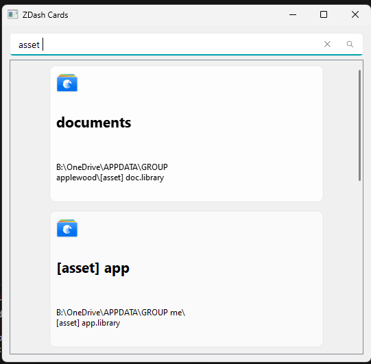

# zdash
 
## install
```
pip install git+https://github.com/ZackaryW/zdash.git
```

## Features
- [x] support eagle and obsidian vaults
- [x] support gui interface to quick launch
- [ ] standardize the config and mod interface 
- [ ] support extension of mods 

## Config
configs are stored in `~/.zdash/config.json`

## Cli Interface
use `zdash` and `zdash --help` for more information

## Gui Interface
use `zdash-gui` or `zdash gui` 

### Showcase


## Acknowledgements
- [eagle-wrap](https://github.com/ZackaryW/eagle-wrap)
- [pyqt-fluent-widgets](https://github.com/zhiyiYo/PyQt-Fluent-Widgets)
